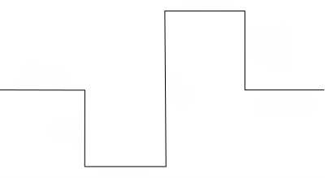

# Лабораторная №1. Основы языка C и первые программы

## Библиотека rbc.h

Для программирования робота EV3 используется библиотека rbc.h, которая предоставляет функции для управления роботом.

## Структура программы

Каждая программа на C начинается с подключения библиотек и описания главной функции:

```c
#include <rbc.h>  // Подключение библиотеки для робота

task main() {
    // Здесь размещается код программы
}
```

## Основные типы данных

- **int** - целые числа *(от -32768 до 32767)*
- **long** - длинные целые числа *(от -2_147_483_648 до 2_147_438_647)*
- **float** - числа с плавающей точкой
- **bool** - логические значения *(true/false)*
- **char** - символы

## Объявление переменных

В C необходимо объявлять переменные перед их использованием:

```c
int integerValue = 42; // В C необходимо объявлять переменные перед их использованием:
float floatValue = 3.14; // Дробное число
bool boolValue = true; // Истина/ложь
```

## Основные функции

### Вывод текста на экран

```c
displayTextLine(1, "Hello, robot!");
displayTextLine(2, "Integer: %d", 42);
displayTextLine(3, "Float: %.2f", 3.14);
```

- Первый параметр — номер строки на экране (1-8)
- %d — вывод целого числа
- %f — вывод дробного числа
- %.2f — вывод дробного числа с 2 знаками после запятой

### Задержка времени

```c
delay(1000);  // Пауза на 1000 миллисекунд (1 секунда)
```

### Управление двигателями

```c
setMotorSpeed(motorA, 50);   // Двигатель A на 50% мощности
setMotorSpeed(motorA, -50);  // Двигатель A назад на 50% мощности
setMotorSpeed(motorA, 0);    // Остановка двигателя A
```

## Задачи для выполнения

### Задача 1.1

Создайте программу, которая:

- Выводит на экран приветствие
- Объявляет переменную типа `int` и присваивает ей значение
- Выводит значение переменной на экран
- Объявляет переменную типа `float` и выводит её с точностью 3 знака

### Задача 1.2

Используя функции управления двигателями, создайте программу движения робота вперед. Время движения подберите экспериментально.

### Задача 1.3

Создайте программу поворота робота по и против часовой стрелки.

### Задача 1.4

Используя рассчитанные значения, создайте программу движения по траектории, представленной ниже.


