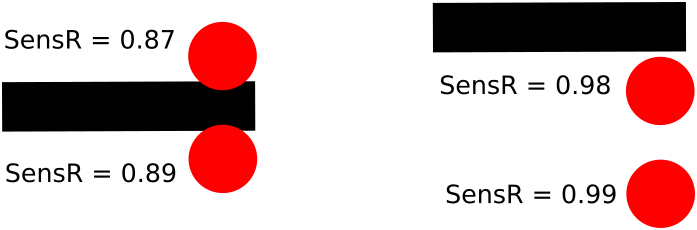

# Лабораторная №9. Алгоритм перехвата управления в системе параллельно исполняемых потоков

При работе P-регулятора возникает критическая ситуация: робот может потерять линию и выйти за пределы области регулирования. Это происходит когда:

- Линия делает резкий поворот
- Скорость движения слишком высока
- Коэффициент Kp настроен неоптимально

Данную ситуацию разрешает реализация автомата возврата перехватывающего управление у P-регулятора. Событием по которому происходит перехват управления является превышение определённого значения суммы левого и правого сенсора.



В приведённом примере сумма нормированных значений датчиков в случае если линия находится в области засветки не превышает 1.76, в случае выхода линии за пределы засветки доходит до 1.97.
Таким образом анализ суммы датчиков позволяет при правильной установки датчиков определить событие типа «потеря области регулировки».

## Задачи для выполнения

### Задача 9.1

Реализуйте систему определения потери линии:

- При превышении порогового значения останавливайте робота
- Выводите диагностическое сообщение

*Распределение задач по потокам виглядит примерно следующим образом:*

```c
#include "rbc.h"

// Константы калибровки (заполнить из задачи 8.1)
int leftMin = ??, leftMax = ??;
int rightMin = ??, rightMax = ??;

// Параметры регулятора
int baseSpeed = 30; // базовая скорость движения
float Kp = 20.0;    // коэффициент пропорциональности

// Нормализованные значения
float leftNorm = 0;
float rightNorm = 0;

// Мониторинг потери линии
float lineThreshold = ?.??;
bool lostLine = false;


float normalizeValue(int value, int minValue, int maxValue){
    return (float)(value - minValue) / (float)(maxValue - minValue);
}


task readSensors(){
    while(true){
        // Работа с датчиками цвета (чтение данных, их нормализация и т.п.)
        ...
    }
}


task lineControl(){
    while(true){
        // Отслеживание потери линии
        ...
    }
}


task displayInfo(){
    while(true){
        // Вывод всех значений, связанных с линией, для отладки
        ...
    }
}


task main(){
    startTask(readSensors);
    startTask(lineControl);
    startTask(displayInfo);

    while(true){
        if (lostLine){
            setMotorSpeed(motorA, 0);
            setMotorSpeed(motorB, 0);
        }
        else{
            // Движение робота по линии при помощи P-регулятора
            ...
        }
    }
}
```

### Задача 9.2

Создайте алгоритм определения направления ухода с линии:

- Анализируйте, какой датчик последним "видел" линию
- Сохраняйте информацию о направлении в глобальной переменной
- Тестируйте на разных участках трассы

Для определения в какую сторону от линии робот уехал, можно постоянно отслеживать какой датчик начинает выдавать низкое значение и указать, что робот потеряется в противоположную от него сторону.

*Для выполнения этой задачи распеределение потоков будет таким же. Добавятся переменные для порогового значения черной линии и направления потери. Еще в поток отслеживания потери линии добавится определение направления потери.*

```c
#include "rbc.h"

...

// Мониторинг потери линии
float lineThreshold = ?.??;
float blackThreashold = ?.??;
bool lostLine = false;
bool goneLeft = false;

...

task lineControl(){
    while(true){
        // Отслеживание потери линии, а так же направление потери
        ...
    }
}
...
```

### Задача 9.3

Реализуйте функцию возврата на линию:

- Робот должен поворачиваться в направлении предполагаемого нахождения линии
- После нахождения линии робот должен вернуться к нормальному следованию

*Добавляем функцию возврата робота на линию. Вызываем ее в основном потоке в том случем, если сработала потеря линии.*

```c
#include "rbc.h"

...

// Мониторинг потери линии
float lineThreshold = ?.??;
float blackThreashold = ?.??;
bool lostLine = false;
bool goneLeft = false;

...

void returnToLine(){
    // Возврат на линию
    ...
}

...

task main(){
    ...

    while(true){
        // Проверка потери линии
        if(lostLine){
            returnToLine();
        }
        // Движение робота по линии при помощи P-регулятора
        ...
    }
}
```
